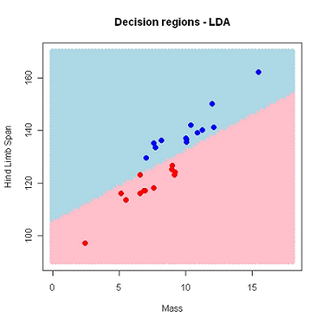
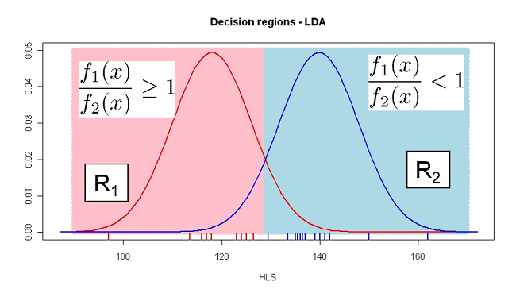
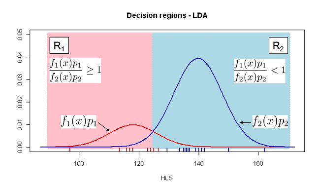
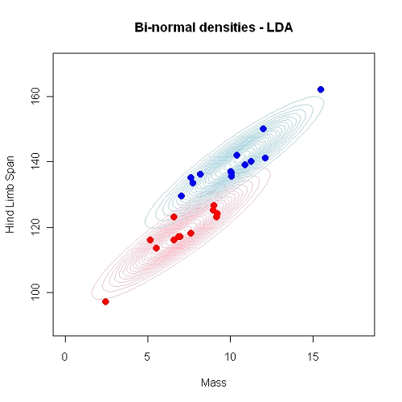
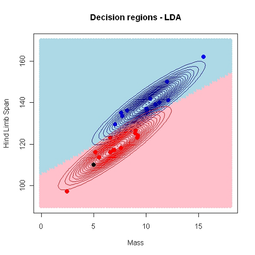
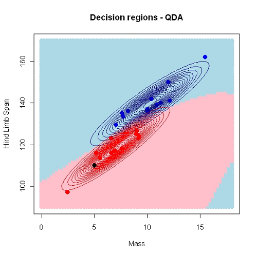

```{r, include = FALSE}
Sys.setenv(RGL_USE_NULL = TRUE)
library(knitr)
library(rgl)
knit_hooks$set(webgl = hook_webgl)
opts_chunk$set(comment = NA, fig.align = 'center', 
               echo = TRUE, out.width = '90%')
is_latex <- knitr::is_latex_output()
```

## Separating and predicting
  
### Discrimination
  + Separating objects in an existing data set
  + Find which variables that best separate the $g$ groups


### Classification
  + Predict group membership for a new observation
  + Allocate new objects to known groups


## Example 1: Iris Dataset {.columns-2}

\begincols
\begincol{.48\textwidth}

```{r, echo = FALSE}
knitr::include_graphics("_images/iris.png")
```

\endcol
\begincol{.48\textwidth}

<div style="break-before: column;"></div>

This famous (Fisher's or Anderson's) iris data set gives the measurements in centimeters of the variables:

- Sepal Length (`X1`) 
- Sepal Width (`X2`) 
- Petal Length (`X3`)
- Sepal Width (`X4`)

\endcol
\endcols

## Example 1: Iris Dataset

```{r, message=FALSE}
load("_data/iris.train.Rdata")
head(iris.train)
```

- Can we classify versicolor or virginica based on X-variables?
- What’s the best method?


## Iris Dataset: Pairs plot

```{r, fig.align='center', out.width=ifelse(is_latex, '50%', '70%'), fig.size = 7}
pairs(iris.train[, -5], bg = iris.train[, "Species"], pch = 21)
```

## Example 2: Lizards {.columns-2}

\begincols
\begincol{.48\textwidth}

```{r, out.width='90%', fig.asp=0.8, fig.width=4.5}
load("_data/Lizard.Rdata")
pairs(Lizard[, -4], bg = Lizard$Sex, 
      pch = 21, cex = 1.5)
```

\endcol
\begincol{.48\textwidth}

<div style="break-before: column;"></div>

| variable | Description                       |
|----------|-----------------------------------|
| Mass     |Weight of lizard (in grams)        |
| SVL      |Snout-vent length (in millimeters) |
| HLS      |Hind limb span (in millimeters)    |

<br/>

- In addition to sex we have measured $k = 3$ more variables on lizards as above. 
- Can we discriminate Sex on the basis of the body measures?

\endcol
\endcols

## Example 2: Lizards {.columns-2}

\begincols
\begincol{.58\textwidth}

```{r 3dplot, echo=FALSE, webgl=TRUE, out.width='100%', fig.width = 5, fig.asp = 1}
if (is_latex) {
  with(Lizard, {
    scatterplot3d::scatterplot3d(
      SVL, Mass, HLS, bg = c("red", "blue")[Sex], 
      pch = 21, angle = 30, lty.hide = 2, 
      col.axis = "grey80", cex.symbols = 2)
  })
} else {
  with(Lizard, {
    rgl::plot3d(SVL, Mass, HLS, size = 2.5, type = "s",
                box = FALSE, axes = FALSE, ylab = "",
                col = c("red", "blue")[as.factor(Sex)])
    grid3d(c("x", "y+", "z"))
    mtext3d(text = 'Mass', edge = 'y+-', line = 2)
    axes3d(c('x', 'y+-', 'z'))
  })
}
```

\endcol
\begincol{.38\textwidth}

<div style="break-before: column;"></div>

<h3>Lizard Dataset</h3>

```{r}
head(Lizard)
```

```{r, echo = FALSE, message=FALSE, warning=FALSE, eval = FALSE}
Lizard$Sex <- ifelse(Lizard$Sex == "m", "Male", "Female")
library(plotly)
scene = list(camera = list(eye = list(x = 0.5, y = -2.25, z = 0.5)))
plotly::plot_ly(Lizard, x = ~SVL, y = ~HLS, z  = ~Mass, size = I(10)) %>% 
  add_markers(color = ~Sex, colors = c("red", "blue"),
              mode = "marker", 
              marker = list(
                opacity = 0.5,
                symbol = 'circle', 
                sizemode = 'diameter',
                line = list(width = 2, color = '#FFFFFF')
              )) %>% 
  layout(scene = scene) %>% 
  config(displayModeBar = FALSE) %>%
  config(showLink = FALSE)
```

\endcol
\endcols

## Finding decision regions {.columns-2}

In descriminant analysis we search for decision regions for the $g$ known groups (classes).

Regions $R_1, R_2, \ldots, R_g$

\begincols
\begincol{.55\textwidth}

<h3>Univariate Descrimination</h3>

```{r, out.width='100%', echo = FALSE}
knitr::include_graphics("_images/Lizards1.png")
```

\endcol
\begincol{.25\textwidth}

<div style="break-before: column;"></div>

<h3>Bivariate discrimination</h3>

```{r, out.width=ifelse(is_latex, '100%', '60%'), echo=FALSE}

```

\endcol
\endcols

Using HLS and Mass as predictors $(k=2)$, we have used a linear decision border. This may also be non-linear.

## Finding decision regions {.columns-2}

\begincols
\begincol{.58\textwidth}

```{r, echo = FALSE, webgl=TRUE, out.width='80%', fig.width = 5, fig.asp = 1}
if (is_latex) {
  with(Lizard, {
    scatterplot3d::scatterplot3d(
      SVL, Mass, HLS, bg = c("red", "blue")[Sex], 
      pch = 21, angle = 30, lty.hide = 2, 
      col.axis = "grey80", cex.symbols = 2)
  })
} else {
  with(Lizard, {
    rgl::plot3d(SVL, Mass, HLS, size = 2.5, type = "s",
                box = FALSE, axes = FALSE, ylab = "",
                col = c("red", "blue")[as.factor(Sex)])
    grid3d(c("x", "y+", "z"))
    mtext3d(text = 'Mass', edge = 'y+-', line = 2)
    axes3d(c('x', 'y+-', 'z'))
  })
}
```

\endcol
\begincol{.38\textwidth}

<div style="break-before: column;"></div>

<h3>Tri-variate discrimination</h3>

- Using all variables $(k=3)$,  
- A linear discriminator is a flat plane in the 3D-space

\endcol
\endcols

## Most probable group

* Perfect discrimination/classification may not be possible.

* The idea is to find decision regions $R_1, R_2, \ldots, R_g$ that <span class="red2">minimizes the probability of doing misclassification</span>.

* Intuitively we would allocate an observation to the group which is most probable given the observed value of the predictors

* If, for example, the HLS of a new lizard is 130, it seems most probable based on previous data that the lizard is a male.

## Bayes rule

Let $P(c_i|x_1,\ldots, x_p)$ be the probability of class $i$ given the observed variables.

Then by Bayes rule:

$$P(c_i|x_1,\ldots, x_p) \propto f(x_1,\ldots, x_p|c_i)p_i$$

where $p_i$ is the _a priori_ probability of observing an object from class $c_i$ and...

$f(x_1,\ldots, x_p|c_i)$ is the likelihood ("probability") of the observed data given class $i$.

## A simple classification scheme

Allocate a new observation with observed variables $x_1^*, x_2^*, \ldots x_p^*$ to the class which
maximizes

$$f(x_1^*,\ldots, x_p^*)p_i$$

We need to estimate $f(x_1^*,\ldots, x_p^*)$ from the training data and determine $p_i$.

In linear discriminant analysis (LDA) we assume that $f(x_1^*,\ldots, x_p^*)$ is a _normal distribution_, hence we must estimate the mean and (a common) variance for observations from each class.

Often we assume uniform prior: $p_1 = p_2 = \cdots = p_g = 1/g$ .

## Lizards example

Assume equal probabilities for females ($c_1$) and males ($c_2$) _a priori_: $p_1 = p_2 = 0.5$

Assume $x_1$ = HLS is the only predictor.

From the data we estimate $\mu_1$, $\mu_2$ and common $\sigma^2$ for both classes. Let $f_1$ and $f_2$ denote these two normal distributions.

Classification rule: Classify a new lizard as _female_ if 

$$f_1(x_1^*)p_1 \geq f_2(x_1^*)p_2$$

or, alternatively if

$$\frac{f_1(x_1^*)p_1}{f_2(x_1^*)p_2}\geq 1$$

## Visual representation 

```{r, out.width='90%', echo = FALSE}

```

## Linear Discreminent Analysis (LDA) in R {.columns-2}

\begincols
\begincol{.48\textwidth}

The fit is presented as a _confusion matrix_ and _accuracy_ of classification

```{r, message=FALSE}
library(MASS)
DAModel.1 <- lda(
  formula = Sex ~ HLS, 
  data = Lizard, 
  prior = rep(0.5, 2))
pred_mdl <- predict(DAModel.1)
```

```{r, echo = FALSE}
head(Lizard, n = ifelse(is_latex, 4, 6))
```

\endcol
\begincol{.48\textwidth}

<div style="break-before: column;"></div>

R also returns the predicted classes (fitted) and $P(c_i|x_1^*)$ also known as the _posterior_ probability.

```{r}
head(pred_mdl$posterior, 4)
head(pred_mdl$class)
```

\endcol
\endcols

## Confusion Matrix and classification error {.columns-2}

```{r, echo = FALSE}
confusion <- function(true, predicted){
  n.lev <- length(levels(predicted))
  a <- table(Predicted = predicted, True = true)
  b <- rbind(a, Total = apply(a, 2, sum), Correct = diag(a), 
             Proportion = diag(a)/apply(a, 2, sum))
  aa <- dimnames(a)
  aa$Predicted <- c(aa$Predicted, "Total", "Correct", "Proportion")
  dimnames(b) <- aa
  class(b) <- "confusion"
  attr(b, "accuracy") <- function(){
    total_correct <- sum(b[n.lev + 2, ])
    total <- sum(b[n.lev + 1, ])
    cat(paste("\nN correct/N total = ", total_correct, 
              "/", total, " = ", format(total_correct/total), "\n", 
              sep = ""))
  }
  attr(b, "error") <- function(){
    total_error <- sum(b[n.lev + 1, ] - b[n.lev + 2, ])
    total <- sum(b[n.lev + 1, ])
    cat(paste("\nN incorrect/N total = ", total_error, 
              "/", total, " = ", format(total_error/total), "\n", 
              sep = ""))
  }
  return(b)
}
print.confusion <- function(obj) {
  attr(obj, "accuracy") <- NULL
  attr(obj, "error") <- NULL
  obj <- unclass(obj)
  print.default(obj)
}
```

\begincols[t]
\begincol{.48\textwidth}

From the observed and predicted class of category `Sex`, we can construct a confusion matrix and calculate classification error. Remember the classification rule is, $$f_1(x_1^*)p_1 \geq f_2(x_1^*)p_2$$

<hr/>

<h3>Can you answer?</h3>

- Can it classify with same accuracy for new observation?
- Since this also depends on prior probability, how will it classify with different priors.

<div style="break-before: column;"></div>

\endcol
\begincol{.48\textwidth}

<h3>Confusion Matrix</h3>

```{r, message=FALSE, warning=FALSE}
confusion(Lizard$Sex, pred_mdl$class)
```


<h3>Accuracy</h3>

```{r, echo = FALSE}
conf_mat <- confusion(Lizard$Sex, pred_mdl$class)
attr(conf_mat, "accuracy")()
```


\endcol
\endcols


## Using different priors

If we assume males are more abundant: $p_1 = 0.2$ and $p_2=0.8$

```{r, echo=FALSE, out.width='75%', warning=FALSE, message=FALSE}

```

## LDA in R using different priors {.columns-2}

\begincols[t]
\begincol{.48\linewidth}


```{r}
DAModel.2 <- lda(
  formula = Sex ~ HLS, 
  data = Lizard, 
  prior = c(0.8,0.2))
pred_mdl <- predict(DAModel.2)
confusion(Lizard$Sex, pred_mdl$class)
```

```{r, echo = FALSE}
conf_mat <- confusion(Lizard$Sex, pred_mdl$class)
attr(conf_mat, "accuracy")()
```

\endcol
\begincol{.48\linewidth}

<div style="break-before: column;"></div>

<h3>The default choice prior</h3>

In R the default choice of prior is "empirical" which means that the priors are
set equal to the group proportions in the data set

Hence, if there are $n_i$ observations in group $i$ and $N = \sum_{i=1}^g n_i$ is the total observation number, then

$$\hat{p}_i = \frac{n_i}{N}$$
This may be reasonable if one assumes that the sample sizes reflect population sizes.

\endcol
\endcols

## Bivariate LDA {.columns-2}

\begincols
\begincol{.48\textwidth}

```{r, echo = FALSE, out.width='100%'}

```

\endcol
\begincol{.48\textwidth}

<div style="break-before: column;"></div>

```{r, echo = FALSE, out.width='100%'}

```

\endcol
\endcols

## Quadratic discriminant analysis (QDA) {.columns-2}

\begincols[t]
\begincol{.48\textwidth}

<h3>A Bivariate QDA - Decision regions</h3>

```{r, echo = FALSE, out.width='100%'}

```

\endcol
\begincol{.48\textwidth}

<div style="break-before: column;"></div>


QDA differs from LDA in two ways:

1. Class specific variances
2. Non-linear decision borders

\noindent\rule{\textwidth}{1pt}

<h3>\textbf{QDA in R}</h3>

```{r, echo = TRUE}
library(MASS)
QDA_model <- qda(
  formula = Sex ~ HLS, 
  data = Lizard, 
  prior = c(0.8,0.2))
pred_mdl <- predict(QDA_model)
```

\endcol
\endcols

## Model selection/evaluation {.columns-2}

\begincols
\begincol{.48\textwidth}

* We often want to compare the performance of different classifiers.

* Many available statistics for this purpose, but we will consider the accuracy or the apparent error rate (APER)

* The performance of a classifier may as we've seen be summarized in a _confusion matrix_

* From the error rate, we can also compute the classification accuracy

\endcol
\begincol{.48\textwidth}

<h3>Apparent Error Rate (APER)</h3>

Consider the confusion matrix as,

<div style="break-before: column;"></div>

```{r, echo = FALSE}
library(kableExtra)
cf <- data.frame(
    Male = c("$n_m/m$", "$n_f/m$", "$n_m$"),
    Female = c("$n_m/f$", "$n_f/f$", "$n_f$")
)
rownames(cf) <- c("Male", "Female", "Total")
knitr::kable(cf, format = ifelse(is_latex, 'latex', 'html'), escape = F) %>% 
  group_rows(group_label = "Predicted", 
                         start_row = 1, end_row = 3) %>% 
  add_header_above(c(" ", "True" = 2)) %>% 
  kable_styling(bootstrap_options = c("striped", "hover", "condensed"))
```


$$
\text{APER} = \frac{n_m/f + n_f/m}{n_m + n_f} = \frac{\text{Total Incorrect}}{\text{Total Observation}}
$$

Classification accuracy will be $1 - \text{APER}$.

\endcol
\endcols

## Example with R: SVL as predictor {.columns-2}

```{r, include = FALSE}
options(digits = 3)
```

\begincols
\begincol{.48\textwidth}

```{r}
DAModel.4 <- lda(
  formula = Sex ~ SVL, 
  data = Lizard, 
  prior = rep(0.5, 2))
pred_mdl <- predict(DAModel.4)
confusion(Lizard$Sex, pred_mdl$class)
```

<div style="break-before: column;"></div>

\endcol
\begincol{.48\textwidth}

<h3>Probabilities of misclassification - APER</h3>

```{r, echo = FALSE}
conf <- confusion(Lizard$Sex, pred_mdl$class)
```

$$
\begin{aligned}
P(\texttt{female | male}) &= \dfrac{`r conf["f", "m"]`}{`r conf["Total", "m"]`} 
  = `r conf["f", "m"] / conf["Total", "m"]` \\
P(\texttt{male | female}) &= \dfrac{`r conf["m", "f"]`}{`r conf["Total", "f"]`} = `r conf["m", "f"] / conf["Total", "f"]`
\end{aligned}
$$

$$
\text{Apparent error rate (APER)} = \frac{`r conf["f", "m"]` + `r conf["m", "f"]`}{`r conf["Total", "m"] + conf["Total", "f"]`} = `r (conf["f", "m"] + conf["m", "f"])/(conf["Total", "m"] + conf["Total", "f"])`
$$

Accuracy = $1-\text{APER} = `r 1 - (conf["f", "m"] + conf["m", "f"])/(conf["Total", "m"] + conf["Total", "f"])`$

\endcol
\endcols

## Validation (Test-data or CV) {.columns-2}

\begincols
\begincol{.48\textwidth}

```{r, echo = FALSE, out.width='100%', message=FALSE, results='hide'}
animation::saveGIF({
  animation::cv.ani(x = runif(150), k = 10, pch = c(4, 1),
                  col = c("green", "red", "blue"))
}, movie.name = "_images/cv.gif", ani.width = 400, ani.height = 350, interval = 1)
```

```{r, echo = FALSE, out.width='100%'}
fname <- if (is_latex) "_images/cv.png" else "_images/cv.gif"
knitr::include_graphics(fname)
```

<div style="break-before: column;"></div>

\endcol
\begincol{0.48\textwidth}

* As for regression models the errors based on fitted values may reflect <span class="red2">over-fitting</span>

* Should have **new** test data to predict to get an honest classification error.

* Alternatively we can perform cross-validation

<h3>Types of Cross-Validation</h3>

* K-fold cross-validation and

* Leave-one-out (LOO) Cross-validation

\endcol
\endcols

## LOO cross-validation: LDA with SVL as predictor {.columns-2}

\begincols
\begincol{0.48\textwidth}

```{r}
da_model <- lda(
  formula = Sex ~ SVL, 
  data = Lizard, 
  prior = rep(0.5,2),
  CV = TRUE)

confusion(Lizard$Sex, da_model$class)
```

\endcol
\begincol{.48\textwidth}

<div style="break-before: column;"></div>

Typically, as seen here, the accuracy goes down, and the APER increases when new samples are classified.

<h3>APER (Error rate)</h3>

```{r, echo = FALSE}
cf_mat <- confusion(Lizard$Sex, da_model$class)
attr(cf_mat, "error")()
```

<h3>Accuracy</h3>

```{r, echo = FALSE}
attr(cf_mat, "accuracy")()
```

\endcol
\endcols

## Thank You {#final-slide .plain}
```{r, out.width='100%', out.height='85%', echo = FALSE, eval = is_latex}
knitr::include_graphics("_images/background.jpg")
```

